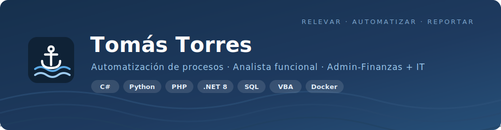

<!--
  README de perfil de GitHub.
  Va en un repositorio llamado EXACTAMENTE igual que tu usuario: "toomastorres/toomastorres".
  Así aparece arriba de todo en tu perfil. Completá los links de demo cuando despliegues.
-->

  

<h1 align="center">Hola, soy Tomás 👋</h1>

  <b>Convierto procesos administrativo-financieros manuales en software.</b> 
  Perfil híbrido: entiendo el negocio (administración y finanzas) <b>y</b> lo programo para automatizarlo.

  <i>Automatización de procesos · Analista funcional · Estudiante avanzado de Ing. en Sistemas (UTN)</i>

  📍 CABA, Argentina &nbsp;·&nbsp; 📫 torrestomas.2004@gmail.com &nbsp;·&nbsp;
  💼 <a href="https://www.linkedin.com/in/tomastorres2004/">LinkedIn</a>

---

### 👤 Sobre mí

Trabajo en el cruce entre el **área administrativo-financiera** y **IT**. Mi día a día es relevar
circuitos que se hacen a mano —liquidaciones, conciliaciones, facturación, reporting— y reemplazarlos
por herramientas que los hacen en segundos, sin errores y con trazabilidad.

Ese es mi diferencial: no soy solo quien programa la solución ni solo quien entiende el proceso.
**Soy las dos cosas.** Eso me deja relevar, diseñar el circuito, construirlo y capacitar al equipo
que lo va a usar.

- 🔄 Automatización de procesos y **análisis funcional** (relevamiento, BPMN, documentación).
- 💰 Dominio de negocio: **administración, finanzas, reporting y BI** para decisiones basadas en datos.
- 💻 Desarrollo: del script en VBA a la app de escritorio en .NET o el servicio web en PHP/Python.
- 🎓 **Estudiante avanzado de Ing. en Sistemas (UTN)** — cursando, egreso estimado 2028.

---

### 🏆 Lo que logré

- ⏱️ **~30% de reducción** en tiempos de carga manual rediseñando circuitos administrativos y sumando automatizaciones.
- 🧩 **Participación en la implementación de un ERP** y elaboración de un **business case** de modernización:
  evalué 4 proveedores (SAP B1, Dynamics 365, Softland, Condor), armé el **modelo financiero (TCO)** y
  recomendé consolidar en **Microsoft (D365 + M365)** → **ahorro de costos demostrado**.
- ☁️ Propuesta de **migración del servidor físico on-premise a la nube** (continuidad + reducción de costos).
- 🤝 **Key user de Salesforce**: adaptación del CRM para áreas administrativas y capacitación del personal.
- 📊 **Reporting financiero y BI** (Power BI) para soporte a la toma de decisiones.

---

### 💼 Experiencia

**Grimaldi Agencies Argentina** — *Financial Analyst & Digital Transformation Lead* · ago 2024 – actualidad
Lidero la transformación digital del área administrativo-financiera:
- **Desarrollo herramientas internas a medida** que automatizan los circuitos (de acá salen, en versión **anonimizada**, los proyectos de abajo).
- Responsable de las **rendiciones de cuenta al armador (casa matriz, Italia)** y de **tareas financieras** operando con esas herramientas.
- **Análisis financiero, business case de ERP y propuesta de migración a la nube** (ver caso de estudio abajo).
- Relevamiento/análisis funcional, integraciones (AFIP/ARCA, ERP de origen) y reporting/BI.

**Rosbaco & Partners** — *Administrative Project Analyst & Salesforce Key User* · dic 2022 – ago 2024
Análisis de proyectos administrativos y key user de Salesforce: adaptación del CRM a las necesidades 
del área y capacitación del equipo.

---

### 🛠️ Stack

**Lenguajes**

**Datos / BI y herramientas**

**IA / agentes (uso diario)**

**Análisis funcional:** relevamiento de procesos · BPMN · documentación (Confluence) · testing (xUnit / pytest)

---

### 🤖 IA en mi flujo de trabajo

Trabajo **AI-augmented**: uso agentes de IA (**Claude Code · Google Antigravity · Gemini**) para acelerar
el desarrollo, el análisis funcional y la documentación — pero **dirijo y valido**: diseño la solución,
entiendo y reviso todo el código, y lo respaldo con **pruebas y CI**. También **integro IA en los productos**:
por ejemplo, diseñé un *bridge* read-only que expone datos a agentes de forma controlada (en el proyecto web).

---

### 🚀 Proyectos destacados

Versiones **anonimizadas** de herramientas internas reales que construí para automatizar procesos
administrativo-financieros. Marca, datos de clientes y secretos fueron reemplazados por datos ficticios.

| Proyecto | Qué problema resuelve | Stack |
|---|---|---|
| 📊 **[Caso de estudio: Modernización de ERP](https://github.com/toomastorres/erp-modernization-case-study)** | Business case de transformación digital: diagnóstico, evaluación de 4 ERPs con matriz de decisión, modelo TCO y propuesta de migración a la nube (recomienda Microsoft D365 + M365). Mi lado **analista funcional**. | `Análisis funcional · TCO/ROI · Cloud` |
| 🧾 **[Facturación Electrónica ARCA/AFIP](https://github.com/toomastorres/arca-electronic-invoicing)** | App de escritorio que emite comprobantes contra los webservices de AFIP (WSAA/WSFEv1): firma digital, CAE, PDF con QR fiscal y reglas propias de negocio. Clean Architecture + 30 tests en CI. | `C# · .NET 8 · WPF · EF Core · SOAP` |
| 🚢 **[Procesador de Manifiestos](https://github.com/toomastorres/maritime-manifest-processor)** | Motor que lee manifiestos de carga y genera en segundos las planillas de liquidación que antes se hacían a mano en horas. Demo web interactiva. | `Python · openpyxl · Streamlit · pytest` |
| 🌐 **[Web Institucional + Portal Interno](https://github.com/toomastorres/maritime-agency-web)** | Sitio multiidioma (ES/EN/IT/PT) con portal privado RBAC para empleados: auth con CSRF, rate-limiting y auditoría. Demo con Docker. | `PHP 8.2 · MySQL · JS · Docker` |
| ⚓ **[Conciliador de Fletes](https://github.com/toomastorres/maritime-freight-reconciliation)** | Registra las facturas de flete de la casa matriz y las concilia contra lo cobrado localmente: trasbordos, motor de diferencia de cambio (ROE) y rendición por buque. | `Excel · VBA · Python` |
| 🚗 **[Cuenta Corriente por Marca](https://github.com/toomastorres/auto-brands-current-account)** | Planilla con macros event-driven que calcula el aging de la deuda de cada terminal automotriz y mantiene el resumen para reportar a la casa matriz. | `Excel · VBA` |

---

### 🎓 Educación

- **Ing. en Sistemas de Información** — UTN · 2023 – actualidad (en curso, egreso est. 2028)
- **Desarrollador Full Stack** — Alura Latam · 2022 – 2023
- **Auxiliar Administrativo, Contable y Financiero** — Instituto CIEC · 2022
- **Inglés intermedio** (certificado)

---

### 📊 GitHub

  
  

---

  <b>¿Tenés un proceso que todavía se hace a mano?</b> Hablemos. 
  📫 torrestomas.2004@gmail.com &nbsp;·&nbsp; 💼 <a href="https://www.linkedin.com/in/tomastorres2004/">linkedin.com/in/tomastorres2004</a>

